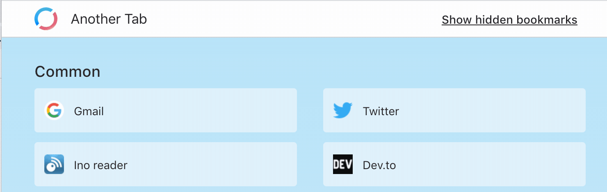
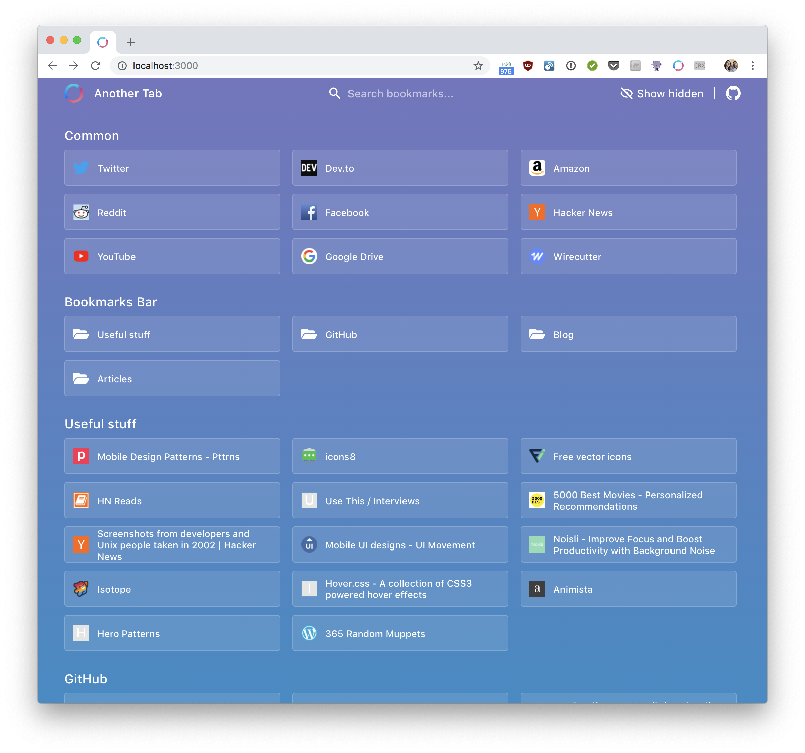
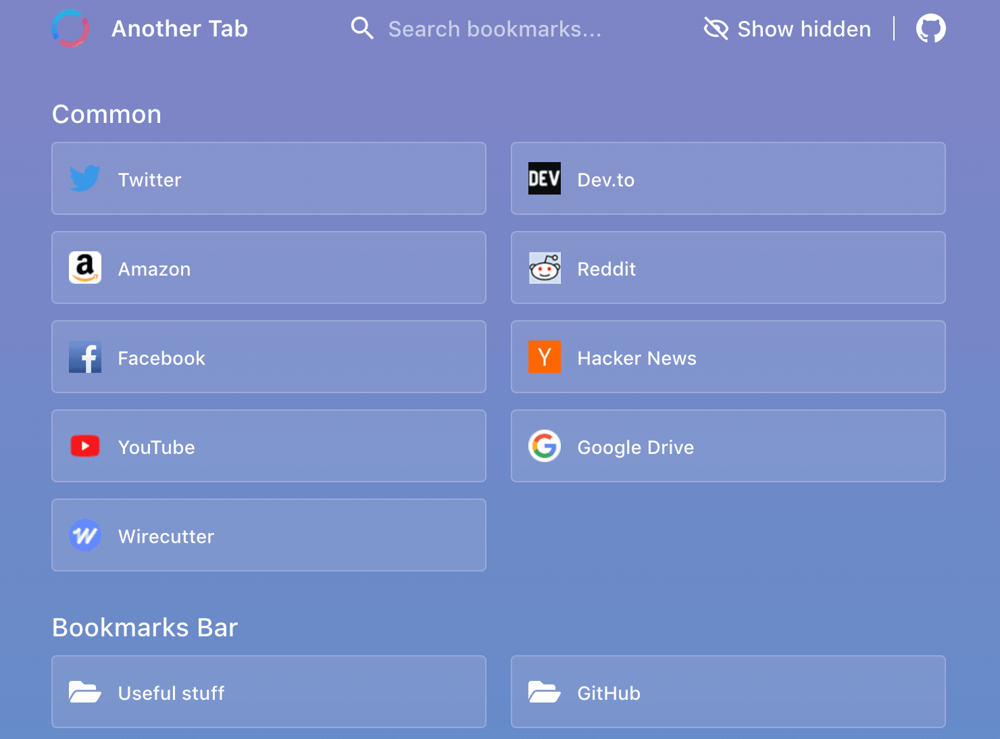
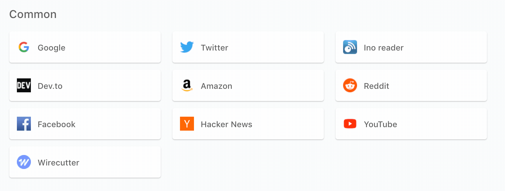

## Nov 23, 2018

### Initial setup (Create React App + TypeScript)

Creating a Chrome Extension seems to be way easier than expected.

Just create the app:

```bash
npx create-react-app chrome-another-tab --typescript
```

Add the Chrome API TypeScript types:

```bash
cd chrome-another-tab && yarn add @types/chrome
```

And update `public/manifest.json` like you'll do for a standard Chrome extension.  
Make sure to set the correct Content Security Policy (see below).

P.S.: Install and use Prettier 👙

### Fixing the Content Security Policy issue

Latest versions of Chrome block inline scripts in Chrome extensions. Since Create React App 2 creates an inline script to run the app you might stumble upon an error message which is related to Content Security Policy (CSP) in the console.  
In the error message you will get a SHA value which can be added to the `manifest.json` file to solve the problem.

### Wrapping the Chrome APIs

The Chrome APIs use a callback-last convention so I'll promisify and wrap them in [`chromeService`](./src/services/chromeService.ts).

### Enabling the extension live reload

The development mode build of Create React App (created by `webpack-dev-server`) seems to be stored directly in memory.  
This means that to test our extension we have to always create a production build.  
As a workaround I'll mock a the result of the Chrome API with a few fixtures while in development.  
See [`chromeService`](./src/services/chromeService.ts).

## Dec 8, 2018

### Getting a bookmark favicon

The Chrome Bookmark API doesn't return the bookmark favicon.  
I investigated a bit and it looks like the two most common ways to grab it right now are:

1. Use the `chrome://favicon/` API (e.g.: `chrome://favicon/twitter.com`) to get the favicon icon, or...
2. Use the `https://www.google.com/s2/favicons?domain=foobar.com` Google service.

Well, guess what, both services return the 16x16 favicon, which looks crappy nowadays.

Thanks to a StackOverflow comment though I was able to discover [faviconkit.com](https://faviconkit.com) which looks amazing: you can fetch up to 144x144px icons and it uses an aggressive caching strategy (both in the browser and on the CDN) so it's incredibly fast.  
The website says that the project is in "free beta" but given how well it performs I suspect it wont' stay free for long.

I still don't know why the Bookmark API doesn't return the 32x32 favicon used in the Chrome bookmarks management (I tried taking a quick look at the Chromium source but I wasn't able to find anything related to that).

<p align="center" margin-bottom="0">
    
</p>

## Dec 15, 2018

### Chrome API

I really like the the shape of the bookmark tree returned by the Chrome API.  
Since it's a tree it might look scary at first but once you get the pattern it just "click", and you can easily iterate trough it using recursion (see `./src/utils/parseBookmarkTree.ts` as an example).

Shoutout to the `@types/chrome` type-definitions: they are immensively helpful for exploring the Chrome APIs.

## Dec 22, 2018

### Styled-Components

Not much to say here, I added styled-components.  
Why styled-components instead of any other library? Well, it's an easy choice for me: it's one of the most used CSS in JS libraries and I like its API (especially in the latest versions).

### State management

Since I'm planning to add a few features that need to share a global state between different components I had (wanted) to pick a state management library.  
Initially I thought about just using the `Context` API, maybe in conjunction with the `useReducer` hook, but since in [my last project](https://github.com/mmazzarolo/just-tap) I fell in love (again) with Redux + TypeScript (and a few other related libraries) I decided to use them here as well.  
The libraries I'm planning to use are:

- Redux
- Redux-Saga
- Typesafe-Actions
- Redux-React-Hook
- Immer

Yes, I know: so many libraries to handle the state when I could have go for MobX ot other smaller libraries...  
Well, there are a few reason why I really dig this setup:

- **Top-notch TypeScript integration.** Everything is type-checked, auto-importable and I feel like I can trust TypeScript to be able to catch even the more subtle error. The only margin of improvement that I can see is a better typing support for Redux-Saga.
- **Small boilerplate.** The boilerplate is way smaller than what you'd expect from a standard Redux setup: Typesafe-Actions allows you to define the actions in a simple way, while Immer takes care of the reducer complexities. And also...
- **Hooks.** Redux-React-Hook and a [small custom hook makes](./src/hooks/useMappedActions.ts) the connection between Redux and React components simple, clear and strongly typed.

The main drawback here (which might be a deal-braker for someone) is that you'll need to learn the API of 5 different libraries...

### Hide-show bookmarks

Added an option to show/hide bookmarks.  
Finding a way to handle the show/hide flow has been really interesting.  
My initial idea was adding an "Edit mode" that, once activated, allowed the user to hide/show the bookmarks and in the future rename/move them.  
After creating a stub of it and playing around though it seemed a bit too clunky for my use cases so I changed the pattern: I'm showing the "hide" options as a floating button that appears on a bookmark after hovering it.  
This also allowed me to experiment a bit with the hovering micro-interaction... since the option was showing up every time you hovered on a bookmark (which is a common action) I added a small delay before showing it, so it won't show up while you're moving between the bookmarks.  
The "hide/show" option icon is small enough to allow me to add another option in the future (if needed).  
I also took the chance to add a custom made persistence/rehydration logic (redux-persist seemed overkill, so I'm just using two small sagas for that) and a button to show/hide the hidden bookmarks.

<p align="center" margin-bottom="0">
    
</p>

## Dec 23, 2018

### A new look

New look! This time I went for a stronger color palette and I reorganized the header.  
Honestly, I haven't put too much attention in details on the UI yet because I'm pretty sure I'll change the theme a few times during the development. Ultimately I'd like providing a simple way to switch between different themes or even to provide your own color scheme...

<p align="center" margin-bottom="0">
    
</p>

### Search

Added a search feature.  
I can now search through bookmarks using the top searchbar.  
The bookmarks filtering is currently done with a Redux selector that takes into account the bookmarks visibility and the current search query.  
I'd like to add a search shortcut and a way to specify if the query should be searched even on hidden bookmarks (right now you have to press the "Show hidden" button to do that).

<p align="center" margin-bottom="0">
    
</p>

## Dec 30, 2018

### Getting a bookmark favicon, round 2

Well, it looks like I was wrong.  
The `chrome://favicon/` API allows you to specify the size of the favicon you need (e.g.: `chrome://favicon/size/16@2x/${url}`), see (./src/utils/getFaviconUrl.ts)[getFaviconUrl.ts]: I'm now getting the favicon from the chrome API when the app is running as an extension and I'm using FaviconKit API to get it when running/testing/developing locally.

### When CMD key is kept pressed, keyup is not triggered for any other key

While working on a keyboard handling hook I discovered that [when CMD key is kept pressed, keyup is not triggered for any other key
](https://stackoverflow.com/questions/27380018/when-cmd-key-is-kept-pressed-keyup-is-not-triggered-for-any-other-key).  
Looks like it is a known behavior of the meta key without any available workaround.
That's not blocking in any way, but it's interesting nevertheless.

## Gen 13, 2019

### Published!

Got some free time today so I took the chacne to publish it on the store.
Publishing a Chrome Extension is quite easy, and seeing that the update is "immediate" is absolutely refreshing if you come from a native app development background.

You can find the extension [here](https://chrome.google.com/webstore/detail/oaaeanlgefipegfcbgpgnhhnpengdjld/publish-accepted?authuser=3&hl=it).

### Added CI

Following [this really good article](https://circleci.com/blog/continuously-deploy-a-chrome-extension/) I was able to setup a CircleCI Continous Integration/Deployment of the extension in 20 minutes.  
The CI runs a `build`, `tsc` and `tslint` command after a push, and if the target branch is `master` it also zips and publish the new extension version to the Chrome Web Store.  
I already have a few ideas on how to improve the process but it is more then enough for now.

## Gen 20, 2019

### Bookmarks sorting

This weekend in the free time I worked on implementing a feature that allows sorting the bookmarks trough drag & drop.  
In the past I already worked on custom drag & drop solutions using [`react-dnd`](https://github.com/react-dnd/react-dnd) and I also played around with the awesome `[react-beautiful-dnd`](https://github.com/atlassian/react-beautiful-dnd).  
This time though I'm dealing with grids instead of list, so `react-dnd` would have been a bit too complex to use (at least for my weekend free time) and `react-beautiful-dnd` doesn't work with grids.  
So, I investigated a bit and have noticed that [`react-sortable-hoc`](https://github.com/clauderic/react-sortable-hoc) seemed to suit well my use case.  
Just like its name suggest, `react-sortable-hoc` is a set of Higher Order Components that makes your components "sortable". It works with both list and grids.  
The library didn't work out of the box for me though, because:

1. CSS grids are not supported yet. I noticed that there was an open PR that add CSS grids support and it was working fine for me, so I [updated it and sent-it again](https://github.com/clauderic/react-sortable-hoc/pull/487). Since it has not been merged yet, I had to deal by myself with it in the code by "simulating" the CSS grid gap property using margings, at least until the PR is merged.

2. `react-sortable-hoc` requires the "sortable" list item component to be the direct child of the "sortable" list/grid, so I had to make a few changes to the components structure to make them work.

3. `react-sortable-hoc` adds some CSS on top of the "sortable" items that might requires some adjustments to your own CSS. In my specific case for example I had to turn off my own `transition` while the item is dragging the item and turn it on after the drop.

That said, the library works well! (Even if I admit I'm a bit worried that will stop be officially maintained soon).

<p align="center" margin-bottom="0">
    
</p>

I also had a lot of fun playing around with the Chrome API for moving bookmarks, [discovering what seems to be a really old bug of it](https://stackoverflow.com/q/13264060/4836602), and implementing an optimistic update (so that we can update the bookmark position in the state without having to wait for the Chrome API response).  

P.S.: Looks like "Bookmarks Bar" and "Other Bookmarks" cannot be sorted :(
