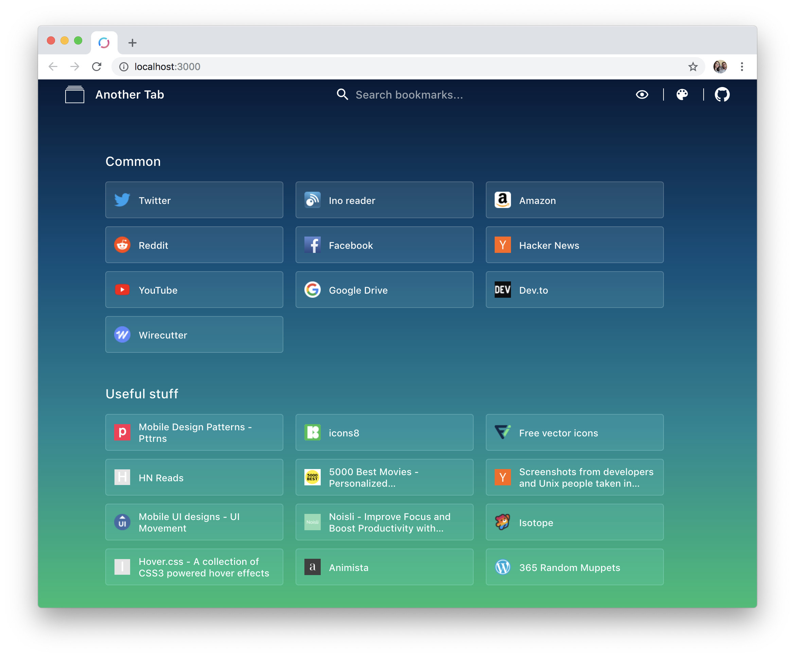

&nbsp;

# Another Tab - Chrome Extension 

An open source Chrome extension that shows your bookmarks when you open a new tab.  
Built with Create React App and TypeScript.

&nbsp;

  

  <a href="https://chrome.google.com/webstore/detail/oaaeanlgefipegfcbgpgnhhnpengdjld">
    
    Another Tab in the Chrome Web Store
  </a>

## Overview

I initially built this extension just for personal use and for trying building a Chrome extension, so it has just the feature that I need for now...  
PRs are welcome!  
[Check the DEVLOG to see the history of the project](./DEVLOG.md).

### Features

- Shows your bookmarks in the new tab page
- Bookmarks filtering/search
- Keyboard navigation support
- Bookmark folders visibility toggle
- Themes support

### Stack

- React (using Create React App) and hooks
- TypeScript
- Styled-Components
- Redux, Redux-Saga and Typesafe-Actions
